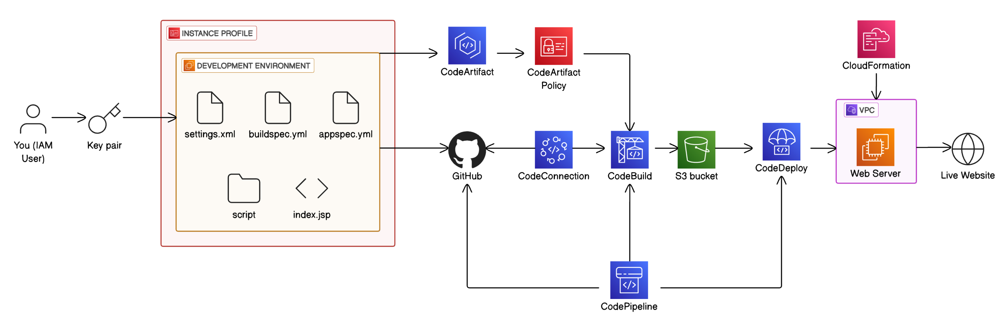

# 🚀 7-Day DevOps Challenge CI/CD Pipeline Project

Welcome to the **CI/CD Pipeline Project** — part of the [7-Day DevOps Challenge! 🚀 by NextWork](https://learn.nextwork.org).

Over the course of this challenge, I built a complete **CI/CD pipeline using AWS Developer Tools**. This hands-on project demonstrates how to take code from **commit to production**, automating building and deployment using modern DevOps practices and AWS Tools.

---

## 🛠️ Project Overview

This project illustrates an end-to-end CI/CD workflow using the following AWS services:

- **CodePipeline** – Orchestrates the workflow.
- **CodeBuild** – Builds and tests the application.
- **CodeDeploy** – Deploys the application to a live EC2 instance.
- **CodeArtifact** – Hosts dependencies (e.g. Maven artifacts).
- **CloudFormation** – Provisions infrastructure (e.g. EC2 inside a VPC).
- **S3** – Stores built artifacts.
- **GitHub** – Stores source code and integrates with AWS using CodeConnection.

---

## 🧱 Architecture Overview

1. **Development Environment**
   - Includes essential configuration files (`settings.xml`, `buildspec.yml`, `appspec.yml`) and application files (e.g., `index.jsp`, deployment scripts).
   - Changes pushed to GitHub trigger the pipeline.

2. **CodeArtifact & Policies**
   - Code dependencies are resolved from AWS CodeArtifact, with proper IAM permissions applied.

3. **CodePipeline Workflow**
   - Pulls code from GitHub via **CodeConnection**.
   - Triggers **CodeBuild** to compile, test, and package the application.
   - Stores artifacts in **S3**.
   - **CodeDeploy** picks up the artifacts and deploys them to an EC2 instance launched by **CloudFormation** within a **VPC**.

4. **Live Website**
   - The result is a fully functional website served from a provisioned **web server**.

---

## 📦 Files and Directories

- `buildspec.yml`: Defines the build steps for CodeBuild.
- `appspec.yml`: Used by CodeDeploy to define deployment hooks.
- `settings.xml`: Maven configuration for accessing CodeArtifact.
- `scripts/`: Contains pre- and post-deployment scripts.
- `index.jsp`: Sample application front-end.

---

## ✅ Key DevOps Skills Gained

- ✅ Building AWS CodePipeline with GitHub integration
- ✅ Using CodeBuild for automated testing and packaging
- ✅ Deploying applications via CodeDeploy and EC2
- ✅ Managing dependencies with AWS CodeArtifact
- ✅ Infrastructure-as-Code using AWS CloudFormation
- ✅ End-to-end automation of the software release process

---

## 📚 About the Challenge

This project was created as part of the **7-Day DevOps Challenge! 🚀 by [NextWork](https://learn.nextwork.org)**

By the end of the challenge, I have:

- Built a full CI/CD pipeline using AWS services
- Automated testing and deployment of a real-world application
- Created 7 portfolio-worthy DevOps artifacts and documentation

---

## 🙌 Special Thanks

Huge thanks to the incredible Natasha — an inspiring, energetic, and hilarious mentor — and the amazing team at NextWork for designing such an impactful and engaging challenge!

---

## 📬 Connect

Feel free to reach out or check my other projects if you'd like to collaborate or ask questions!

